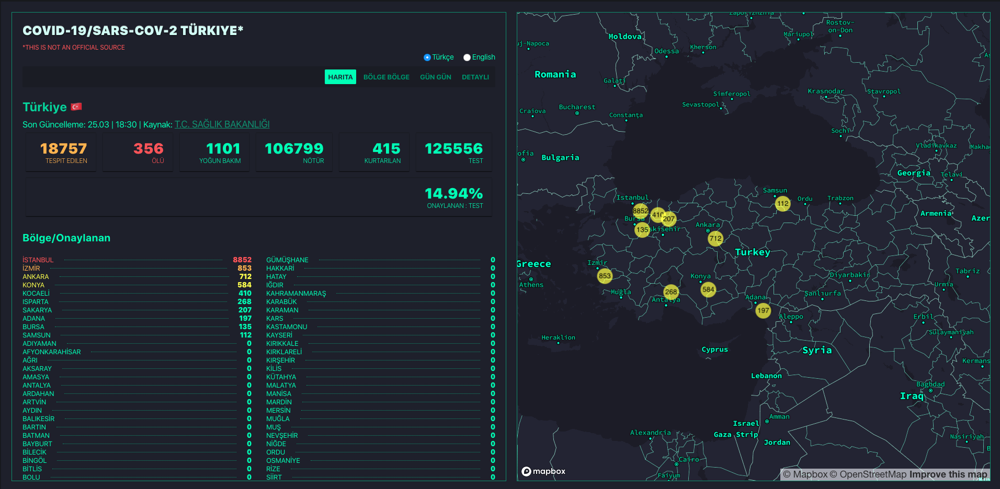

This project was bootstrapped with [Create React App](https://github.com/facebook/create-react-app).

## **Türkiye**




Kurulum için

- mapbox.com hesabı oluşturup api token alın
- Token'i aşağıda belirtilen şekilde ekleyin `/.env.local`

```
REACT_APP_MAPBOX_ACCESS_TOKEN=token
```

- `npm i && npm start`


kaynak: https://github.com/juanmnl/covid19-monitor
😅

**Otros Países**
Tomen este repo y háganlo suyo. Está claro que nuestros gobiernos no nos van a facilitar la visualización y rastreo del impácto del virus, por lo que les pido lo tomen en sus manos.

✊✊🏻✊🏼✊🏽✊🏾✊🏿

🇪🇨https://www.monitorec.app

🇧🇷https://covid19br.app

🇲🇽(Sonora) https://covid19-monitor-sonora.netlify.com/
